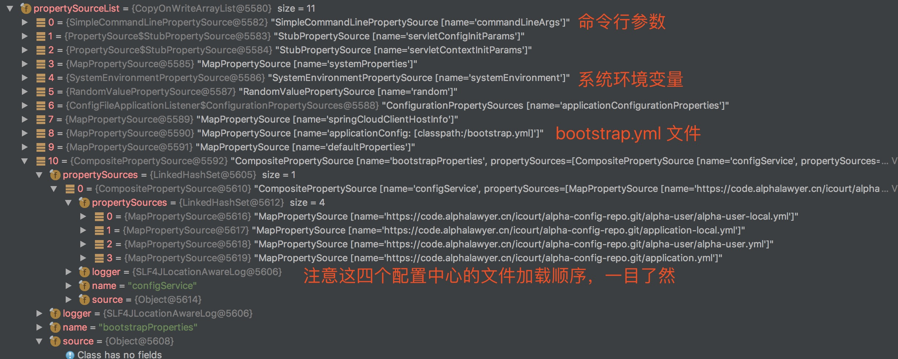

## 前言

众所周知，Spring Boot 的一大特性就是"约定优于配置"，Spring Boot 之所以这么受欢迎，简化配置这一项功不可没，所以，当你了解了 Spring Boot 的配置原理后，你就了解了 Spring Boot 的整个理念。

这是 Spring Boot 配置系列第一篇，主要讲一下 Spring Boot加载配置的流程和原理。

### 相关类

#### PropertySource<T>

```java
public abstract class PropertySource<T> {

	protected final Log logger = LogFactory.getLog(getClass());

	protected final String name;

	protected final T source;
}
```

属性源，每一份属性来源都是一个PropertySource ，其中 `name` 代表数据源的名称，`source` 代表数据源，比如说它的一个子类 `ResourcePropertySource`，代表一个资源的数据源，`name` 就可能是 `application.yml`，`source` 就是 yml 文件里面的值。 

#### PropertyResolver

属性解析器，它是一个顶级接口，用来解析所有的属性来源，其中最重要的就是 `String getProperty(String key)` 方法，它用来读取属性某个 key 的值，而不用关心它的来源。

#### Environment

`Environment`可以看做 Spring 对整个环境属性的抽象，它继承了`PropertyResolver` ，所以能通过它获取程序的配置，同时它又增加了 `String[] getActiveProfiles()` 等方法，用来获取程序当前激活的 `profile`。

把 `Environment` 注入即可获取程序配置。

```java
@Service
public class TestService extends implements ITestService {
  
    @Autowired
    Environment environment;

    public void testEnvironment(){
        log.info(environment.getProperty("spring.application.name"));
    }
}
```

### 属性加载流程

在 Spring Boot 启动调用的 `run()` 方法中

```java
	// 准备 Environment 环境
	ConfigurableEnvironment environment = prepareEnvironment(listeners,
					applicationArguments);
	...
	context = createApplicationContext();
	//准备容器
	prepareContext(context, environment, listeners, applicationArguments, printedBanner);
	...
```

在 run 方法中可以发现，程序会先准备 Environment 环境，然后才创建容器。

```java
	private ConfigurableEnvironment prepareEnvironment(
			SpringApplicationRunListeners listeners,
			ApplicationArguments applicationArguments) {
		// Create and configure the environment
		ConfigurableEnvironment environment = getOrCreateEnvironment();
		configureEnvironment(environment, applicationArguments.getSourceArgs());
		listeners.environmentPrepared(environment);
		if (isWebEnvironment(environment) && !this.webEnvironment) {
			environment = convertToStandardEnvironment(environment);
		}
		return environment;
	}
```

在 `prepareEnvironment()`  方法中，首先会创建 `ConfigurableEnvironment` ，在这里需要注意的是，程序会判断当前 `environment` 类型，如果是标准的 `StandardEnvironment` 会加载系统环境属性和 JVM 环境属性，如果是 `StandardWebEnvironment` 还会额外加载 `servlet` 相关的属性。 

`StandardWebEnvironment` 判断方法如下：

```java
	private boolean deduceWebEnvironment() {
		for (String className : WEB_ENVIRONMENT_CLASSES) {
			if (!ClassUtils.isPresent(className, null)) {
				return false;
			}
		}
		return true;
	}

其中：
String[] WEB_ENVIRONMENT_CLASSES = { "javax.servlet.Servlet",
			"org.springframework.web.context.ConfigurableWebApplicationContext" };
```

其中，在 StandardWebEnvironment 中，有一个特别重要的属性 `MutablePropertySources propertySources`，它的 `class` 定义如下（省略部分代码）：

```
public class MutablePropertySources implements PropertySources {

	private final Log logger;

	private final List<PropertySource<?>> propertySourceList = new CopyOnWriteArrayList<PropertySource<?>>();
   
	@Override
	public boolean contains(String name) {
		return this.propertySourceList.contains(PropertySource.named(name));
	}

	/**
	 * 把数据源添加到List队首，优先级最高
	 */
	public void addFirst(PropertySource<?> propertySource) {
		...
	}

	/**
	 * 把数据源添加到List队尾，优先级最低
	 */
	public void addLast(PropertySource<?> propertySource) {
		...
	}

	/**
	 * 添加到给定的配置文件名之前
	 */
	public void addBefore(String relativePropertySourceName, PropertySource<?> propertySource) {
		...
	}

}

```

所以，所谓的配置文件优先级，其实就是该数据源在 `propertySourceList` 中的位置。通过 DEBUG 模式，我们看看 `List<PropertySource>` 的顺序。



通过查看 `PropertyResolver` 的 `getProperty(String key)` 方法同样可以印证这一点。

```java
protected <T> T getProperty(String key, Class<T> targetValueType, boolean resolveNestedPlaceholders) {
		for (PropertySource<?> propertySource : this.propertySources) {
			Object value = propertySource.getProperty(key);
			if (value != null) {
				if (resolveNestedPlaceholders && value instanceof String) {
					value = resolveNestedPlaceholders((String) value);
				}
				logKeyFound(key, propertySource, value);
				return convertValueIfNecessary(value, targetValueType);
			}
		}
	}
}
```

可以发现当试图获取一个属性时，会顺序遍历 `List<PropertySource>`，只要在当前 `PropertySource` 中通过 key 获取到 value，就直接返回，后面的配置即使有相同的 key 也不会被加载。
